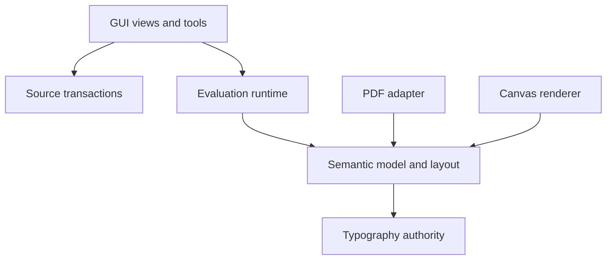

# Modularity assessment

Updated: 2026-07-17

## Outcome

The headless architecture had sound top-level separation, but the first GUI vertical slice accumulated six responsibilities in `pydesign.gui.app`. That module reached 1,140 lines and was the dominant maintainability risk. It is now a 21-line compatibility facade. The frame rewriter's former private-helper coupling has also been removed: shared edit values and formatting-preserving LibCST operations have explicit modules, reducing `source.rewrite` from roughly 560 to 390 lines.

The GUI has been refactored without changing the `pydesign.gui.app` entrypoint:

| Module | Responsibility | Dependency direction |
|---|---|---|
| `gui.app` | Stable `run()` facade and compatibility exports | `window`, `canvas` |
| `gui.window` | Project/editor orchestration and user decisions | canvas/inspector/commands, runtime, source APIs |
| `gui.canvas` | Scene rendering and tool interaction; emits semantic intents | GUI types and source value types only |
| `gui.inspector` | Geometry/provenance controls; emits edit intents | GUI/source value types |
| `gui.commands` | Undoable source-plan application | source API and a small host `Protocol` |
| `gui.types` | Shared GUI value contracts and runtime narrowing | QtCore and source value types |
| `gui.evaluation` | QProcess lifecycle and protocol decoding | QtCore only; emits response/error values |

Source editing now separates `source.edits` (public immutable plan/value contracts), `source.cst_helpers` (unit/format/import primitives), `source.rewrite` (frame and insertion policy), `source.path_rewrite` (cubic control-point policy), `source.transaction` (atomic application) and `source.journal` (crash recovery). Path rewriting no longer imports private names from frame rewriting.

`SourcePlanCommand` no longer names or imports `MainWindow`; it accepts a `SourceCommandHost` protocol. This makes command behavior independently testable and prevents a window↔command cycle.

## Current module health

| Area | Assessment | Main follow-up |
|---|---|---|
| Units/model/layout/validation | Cohesive and renderer-neutral | Split model by geometry/path/text only when each family grows materially |
| Runtime | Clear project/client/evaluator/worker/recovery boundaries | Add typed cancellation/stale-result state, not GUI callbacks |
| Source | Explicit edit/CST/frame/path/transaction/journal modules; no private cross-family dependency | Add style/property modules by ownership family rather than expanding `rewrite.py` |
| Typography | Font, registry/fallback, glyph, break, paragraph, flow and shaping authorities are separate | Add bidi itemisation/optimisation modules rather than expanding shaping/flow |
| GUI | Refactored into canvas/view/command/evaluation/orchestration seams | Extract editor session before window reaches its 575-line budget |
| PDF | Optional adapter consumes display-list values and refuses non-authoritative text | Split paint/inspection/manifest modules as shaped text and image operations land |
| CLI | Acceptable 230-line dispatcher with lazy optional imports | Move export/preflight handlers to command modules as Stage 4 expands |

## Enforced rules

`scripts/check_architecture.py` now fails when:

- any Python module exceeds 600 lines;
- the stable `gui.app` facade exceeds 100 lines;
- `gui.window` exceeds its tighter 575-line orchestration budget;
- core modules import PySide6;
- `runtime` imports GUI;
- `source` imports GUI, runtime or typography;
- `text` imports GUI, runtime or source editing;
- `pdf` imports GUI, runtime or source editing;
- canvas depends on the main window;
- any explicit internal Python module dependency cycle exists.

The limits are architectural tripwires, not quality scores. A 590-line file can still be poorly factored, while a small module can still have the wrong responsibility. Review must also consider ownership, dependency direction, test seams and whether public contracts are renderer-neutral.

## Target dependency shape

Source editing does not sit below or inside the semantic model: it is an authoring adapter that turns GUI intent into visible Python and then asks the runtime to rebuild. Canvas and PDF consume one layout contract and must not independently compose document text.
